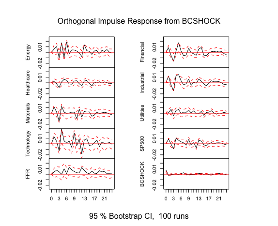

## Introduction

In this paper, I explore the implementation of impulse response functions to analyze the transmission of monetary policy shocks. Portfolio risk management is typically conducted using relevant historical data. For example, interest sensitivity tests can be performed through multiple Monte Carlo simulations, assuming distributions of interest rate shocks such as movements in the federal funds rate or treasury yields. These simulations parametrically model the source of shocks. However, prior methods do not separately account for unanticipated shocks in monetary policy, which are known to influence federal funds rates or treasury yields. To accurately assess sensitivity to monetary policy shocks, it is essential to consider these unanticipated shocks directly.\
In this paper, I argue that considering unanticipated monetary policy shocks is crucial for evaluating interest rate sensitivity. I demonstrate that portfolios exhibit heterogeneous impulse responses to these shocks, varying by sector. The results indicate that, on average, portfolios concentrated in technology, financial, and energy sectors show more volatile responses to unanticipated monetary policy shocks compared to the S&P 500 baseline.


## VARs and Local Projection Review

Before proceeding to a formal analysis, I review the concept of VAR and Local Projection Methods to calculate impulse responses.

### Brief Introduction of VAR

Suppose you have a vector of variables that follow the AR(1) process: $$
v_t = \begin{bmatrix} v_{1t}\\v_{2t}\\:\\\end{bmatrix} = \begin{bmatrix} a_{11} & a_{12} &...\\a_{21} & a_{22} & ...\\: &: & .\\\end{bmatrix} \begin{bmatrix} v_{1t-1}\\v_{2t-1}\\:\\\end{bmatrix} + \begin{bmatrix} \epsilon _{1t}\\\epsilon_{2t}\\:\\\end{bmatrix} =Av_{t-1} + \epsilon_{t}$$ where $\epsilon_t \sim \mathcal{N}(0,\,\Sigma)$. This representation assumes that the variables $(v_{it})_i$ depend on each other with a lag and is called VAR(1) process. Let $L$ be a lag operator such that $v_t=Lv_t=v_{t-1}$, and if $(I-AL)$ is indeed invertible (or if the spectral radius of $AL$, $\rho(A)$, is less than 1), the above equation has a following representation. $$ v_t = (I-AL)^{-1}\epsilon_t$$ This shows that one can represent $v_t$ as a function of impulse response. Under the same assumption, one can also indeed show that $$ (I-AL)^{-1} = \sum_{t=0}^\infty (AL)^t$$ which shows that VAR(1) has MA($\infty$) representation. We then have
$$ v_t =  \sum_{t=0}^\infty A^t\epsilon_0 $$

We have expressed $v_t$ as a response to an initial shock. This formation makes the calculation of impulse response fairly intuitive.\

As an example, suppose that we believe GDP growth, unemployment rate, and inflation follows VAR(1) process. Then we can represent it in the following form: $$ \text{GDPgr}_t = \theta_{11}\text{unemp}_{t-1} + \theta_{12} \text{inf}_{t-1} + \theta_{13}\text{GDPgr}_{t-1} + \epsilon_{1t}$$ $$\text{unemp}_t = \theta_{21}\text{unemp}_{t-1} + \theta_{22} \text{inf}_{t-1} + \theta_{23}\text{GDPgr}_{t-1} + \epsilon_{2t} $$ $$\text{inf}_t = \theta_{31}\text{unemp}_{t-1} + \theta_{32} \text{inf}_{t-1} + \theta_{33}\text{GDPgr}_{t-1} + \epsilon_{3t}$$ The impulse response of VAR(p) (although a meaningful interpretation requires orthogonalized shocks) can be calculated by expressing the vector in MA($\infty$) form.

### Local Projection

I showed above that impulse response function can be calculated if one assumes that the variables of her/his interest has VAR(p) form. However, some times, this data generating process assumption can be sensitive to misspecification. Jorda (2005) showed that there is an alternative method that is more robust to misspecification than VARs. The method to find the impulse response function is called local projection method. Here is how one can estimate it. This is from the example in Jorda (2005). Suppose you have a variable of interest $y_t$. Then, you project it on the space spanned by $\{y_{t-i}\}_{1\le i \le p}$ with the following sequence of regressions: $$y_{t+s} = \alpha^s+\beta^{s+1}_1 y_{t-1} + \beta^{s+1}_2 y_{t-2} +...+ \beta^{s+p}_p y_{t-p} +u^s_{t+p}$$ for each $s \in \{1,2,3,..\}$ At each regression, we obtain the sequence of coefficients $\{\beta_1^s\}_s$. This is our impulse response coefficients. Indeed, not only does the regression come with asymptotic normality, the impulse responses $\{\beta_1^s\}_s$ are also consistent since the error term $u^s_{t+p}$ are uncorrelated with each of the regressor (Jorda 2005). If for instance, one is interested in finding the impulse response of GDP growth when there is a unit shock in, say, inflation one can calculate it by running the sequence of following regressions. Furthermore, stationarity is not required to obtain the result. 
$$\text{GDPgr}_{t+s} = \alpha^s+\beta^{s+1}_1 \text{inf}_{t-1} +...+ \beta^{s+p}_p \text{inf}_{t-p} + \delta_1^{s+1}\text{GDPgr}_{t-1} +...+ \delta_1^{s+p}\text{GDPgr}_{t-p} +u^s_{t+p}$$
And sequence of coefficients $\{\beta_1^s\}_s$ represents the impulse response to a unit shock. 

## Data Description

My stock portfolio data comes from Yahoo finance. The list of our portfolios are as follows:\
1) Energy Select Sector SPDR Fund\
2) Financial Select Sector SPDR Fund\
3) Health Care Select Sector SPDR Fund\
4) Industrial Select Sector SPDR Fund\
5) Materials Select Sector SPDR Fund\
6) Utilities Select Sector SPDR Fund\
7) Technology Select Sector SPDR Fund\
8) S&P 500 Index\
\
My monetary policy shock data come from Ramey (2016) and are available here [https://econweb.ucsd.edu/~vramey/research.html]. The data include shocks identified by Romer and Romer (2004) and Barakchian and Crowe (2013). Using shocks identified by Romer and Romer addresses endogeneity concerns by controlling for expected and endogenously determined shocks by the Fed. This is crucial because agents react to monetary policy based on their expectations before policy implementation, making direct estimation of monetary policy effects challenging. Additionally, the Fed's internal information about the economy influences its policy decisions, resulting in endogenous policy actions. Therefore, using the Federal funds rate as a proxy for monetary policy may understate the policy's effects. By focusing on unexpected and economy-independent policy components, we obtain relatively exogenous monetary policy shocks. Fortunately, Romer and Romer (2004) and Barakchian and Crowe (2013) have identified such shocks. In this paper, I use the shocks identified by Barakchian and Crowe (2013).

Combining both portfolio data and monetary policy shock data, I have monthly time series data from 1999 January to 2008 June. 

## Specification and Result
With the sector specific portfolio data, I then estimate the impulse response function by using both VAR and local projection methods. First, I run VAR(6) (monthly data) separately for each portfolio. I always include Federal Funds Rate (FFR), S&P500 (SP500), and the monetary policy shock (Barakchian and Crowe 2013) for calculating impulse response of each portfolio.\
Following plots are the impulse response of each of the portfolio.\


```{r echo=FALSE, message=FALSE}
library(gridExtra)
library(png)
library(grid)


for (i in c(8, 10, 12)) {
  file_name1 <- sprintf("Rplot%02d.png", i)
  file_name2 <- sprintf("Rplot%02d.png", i+1)
  img1 <- readPNG(file_name1)
  img2 <- readPNG(file_name2)
  grid.arrange(rasterGrob(img1),rasterGrob(img2), ncol=2)
}

```


Above shows the impulse response of each portfolio when I run VAR separately. The below, however, shows the impulse response of each portfolio and my control variables estimated by VAR jointly.  




In the initial three months, all portfolios experience an increase in response to an exogenous monetary policy shock, followed by a sharp decline. Subsequently, each portfolio trends upward but with a progressively slower decline and decreasing amplitude. It is important to note that the degree of volatility varies across portfolios. Specifically, the Technology, Energy, and Financial portfolios display higher and more persistent volatility compared to others.\
Next, let's compare the impulse response functions (IRFs) obtained from the VAR model with those derived using the local projection method. Below, we present the IRFs from the local projection method.
\

```{r echo=FALSE, message=FALSE}
library(gridExtra)
library(png)
library(grid)


for (i in c(1, 3, 5)) {
  file_name1 <- sprintf("Rplot%02d.png", i)
  file_name2 <- sprintf("Rplot%02d.png", i+1)
  img1 <- readPNG(file_name1)
  img2 <- readPNG(file_name2)
  grid.arrange(rasterGrob(img1),rasterGrob(img2), ncol=2)
}
grid.arrange(rasterGrob(readPNG("Rplot.png")), ncol=2)

```


The impulse response functions (IRFs) from the local projection method reveal some notable differences from those estimated by VAR models. In particular, the Energy and Technology portfolios exhibit the highest volatility. Unlike the VAR estimates, which generally show a consistent pattern of an initial increase followed by a sharp decline and then a smaller rebound, the local projection IRFs suggest more varied responses to monetary policy shocks.\
For example, the Healthcare portfolio responds negatively to a positive monetary policy shock, while the Materials, Utilities, Financial, and Energy portfolios show positive responses. In contrast, the Technology and Industrial portfolios initially increase for up to 12 months before gradually declining into negative returns.\
From a risk management perspective, the implication is straightforward: after 12 months following a positive rate change shock, it may be prudent to reduce holdings in Technology and Industrial stocks and increase holdings in Financial, Energy, or Materials stocks.


